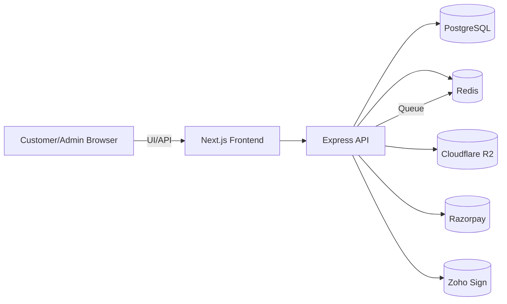

# Kala Vault MVP Architecture

## Executive Summary
Kala Vault is a premium B2B artwork rental SaaS platform for builders, luxury homes, offices, cafes, and coworking spaces. The MVP is designed as a modern two-tier architecture with a TypeScript backend API, PostgreSQL data platform, Redis-backed async processing, and a premium Next.js 15 frontend.

## Architecture Overview

### System boundaries
- Backend API: authenticated REST API, service layer, repository layer, integrations
- Frontend: Next.js 15 app router, premium SaaS UI, customer and admin dashboards
- Data: PostgreSQL for transactional data, Redis for caching and queues, Cloudflare R2 for media storage
- Integrations: Razorpay billing, Zoho Sign contract signing, Cloudflare R2 signed URLs

### Core services
- Auth & identity
- Artwork inventory & media
- Subscription billing
- CRM & pipeline
- Contract lifecycle
- Support & notifications
- Audit & security

## Phase-by-phase delivery

### Phase 1: System architecture
- Modular monorepo layout: `backend/`, `frontend/`
- Clean separation: controllers, services, repositories, integrations, middleware
- API-first design with shared DTO/validation layer
- PostgreSQL relational model optimized for artwork rental and subscription flows

### Phase 2: Security foundation
- JWT access tokens + rotating refresh tokens
- RBAC using `roles`, `permissions`, and role guards
- 2FA-ready structure in authentication service
- Audit logging and device/IP capture
- Global rate limiting and CSRF protection

### Phase 3: Inventory & media
- Artwork catalog with multiple image assets
- Cloudflare R2 pipeline for upload, processing, signed URL delivery
- Image protection via time-limited signed URLs and watermark metadata
- Warehouse / location tracking and swap request workflows

### Phase 4: Billing & invoicing
- Customer subscriptions managed in PostgreSQL with Razorpay recurring plans
- Invoice generation with GST fields and retry orchestration
- Webhooks for payment success, failures, and subscription lifecycle
- Strong transactional handling across billing and subscription state updates

### Phase 5: CRM workflows
- Lead management, proposal tracking, reminders, and staged pipelines
- Activity logs and CRM activities tied to leads and accounts
- Workspace-level customer records with assigned account managers

### Phase 6: Contracts
- Contract templates plus Zoho Sign e-sign integration
- Contract status, renewals, and reminders modelled in the database
- Secure document references and audit trails

### Phase 7: Admin dashboard
- Analytics and reporting for inventory, payments, customers, and contracts
- Inventory overview with warehouse stock, swap requests, and stock aging
- Billing overview with recurring revenue, failed payments, and collections

### Phase 8: Customer dashboard
- Artwork browsing, subscription management, support, and invoice downloads
- Self-service swap requests and contract summaries
- Premium experience with responsive mobile-first UI

### Phase 9: DevOps
- Self‑hosted deployment without containers
- GitHub Actions CI for lint, test, and build
- NGINX reverse proxy for production deployment
- Environment config separation and backup strategy for PostgreSQL/R2

## Technology decisions
- Backend: Node.js 20+ and TypeScript, Express, Prisma, Redis, BullMQ
- Frontend: Next.js 15 app router, TailwindCSS, shadcn/ui, Framer Motion
- Data: PostgreSQL with UUID primary keys, strong FK constraints, soft deletes
- Storage: Cloudflare R2 for artwork assets, signed CDN delivery
- Billing: Razorpay for Indian SaaS recurring payments, GST support
- E-sign: Zoho Sign for contract signing workflows

## Security strategy
- Secure cookies for refresh token storage
- HTTP-only JWTs and bearer tokens for API access
- CSRF middleware on stateful routes
- IP/device audit trail for login and token refresh
- Protected admin route guard and feature-level permission checks

## Performance strategy
- Redis for cache and session-level rate limiting
- Background jobs for invoice generation and contract renewals
- Lazy-loading API results with pagination and filtering
- Image CDN signed URL delivery to offload media traffic
- SQL indexes and selective joins to avoid N+1 problems

## Deployment architecture
- Containerized backend + frontend
- Reverse proxy NGINX in front of services
- Managed PostgreSQL with daily backups and PITR
- Redis for cache and queue persistence
- GitHub Actions for CI/CD with staging and production pipelines

## Service boundary diagram

