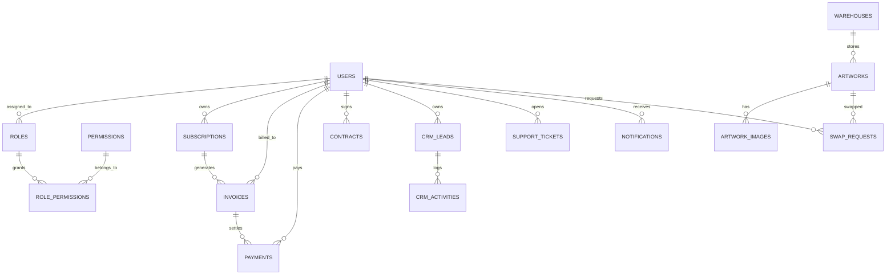

# Kala Vault Database Schema

## Design Principles
- PostgreSQL production-grade relational model
- UUID primary keys for global uniqueness
- Soft delete with `deleted_at`
- Audit timestamps: `created_at`, `updated_at`
- Strong FK constraints and enum domains
- Indexes for search, filtering, and joins
- Transactional boundaries for billing and contract updates

## Core tables

### `users`
- `id` UUID PK
- `email` unique
- `password_hash`
- `first_name`, `last_name`
- `phone`
- `role_id` FK to `roles`
- `status` enum (`active`, `pending`, `suspended`)
- `two_factor_enabled`, `two_factor_secret`
- `last_login_at`, `last_login_ip`
- `deleted_at`
- `created_at`, `updated_at`

Indexes:
- `idx_users_email`
- `idx_users_role_id`

### `roles`
- `id` UUID PK
- `name` unique
- `description`
- `is_admin`

### `permissions`
- `id` UUID PK
- `name` unique
- `description`
- `group`

### `role_permissions`
- `role_id` FK
- `permission_id` FK
- composite PK

### `artworks`
- `id` UUID PK
- `sku` unique
- `title`, `description`
- `artist`, `style`, `medium`
- `year_created`, `dimensions`
- `category` enum
- `status` enum (`available`, `rented`, `reserved`, `maintenance`)
- `warehouse_id` FK
- `rental_price_monthly`
- `replacement_value`
- `metadata` JSONB
- `deleted_at`
- `created_at`, `updated_at`

Indexes:
- `idx_artworks_status`
- `idx_artworks_warehouse_id`
- `idx_artworks_category`
- Gin index on `metadata`

### `artwork_images`
- `id` UUID PK
- `artwork_id` FK
- `file_key` Cloudflare R2 object key
- `variant` enum (`hero`, `gallery`, `thumbnail`, `watermark`)
- `mime_type`
- `width`, `height`
- `order`
- `is_secure`
- `deleted_at`
- `created_at`, `updated_at`

### `warehouses`
- `id` UUID PK
- `name`, `address`, `city`, `state`, `country`
- `contact_name`, `contact_phone`
- `capacity`
- `deleted_at`
- `created_at`, `updated_at`

### `subscriptions`
- `id` UUID PK
- `customer_id` FK to `users`
- `plan_name`
- `razorpay_subscription_id`
- `status` enum (`active`, `paused`, `cancelled`, `past_due`, `trial`)
- `start_date`, `next_billing_date`, `billing_cycle`
- `amount_cents`
- `currency`
- `gst_percentage`
- `metadata` JSONB
- `deleted_at`
- `created_at`, `updated_at`

Indexes:
- `idx_subscriptions_customer_id`
- `idx_subscriptions_status`
- `idx_subscriptions_next_billing_date`

### `invoices`
- `id` UUID PK
- `subscription_id` FK
- `customer_id` FK
- `razorpay_invoice_id`
- `status` enum (`draft`, `issued`, `paid`, `failed`, `cancelled`)
- `issue_date`, `due_date`, `paid_date`
- `amount_cents`, `tax_cents`, `total_cents`
- `gst_rate`
- `invoice_data` JSONB
- `deleted_at`
- `created_at`, `updated_at`

Indexes:
- `idx_invoices_customer_id`
- `idx_invoices_status`
- `idx_invoices_issue_date`

### `payments`
- `id` UUID PK
- `invoice_id` FK
- `subscription_id` FK
- `customer_id` FK
- `razorpay_payment_id`
- `status` enum (`pending`, `completed`, `failed`, `refunded`)
- `amount_cents`
- `currency`
- `payment_method`
- `gateway_response` JSONB
- `processed_at`
- `deleted_at`
- `created_at`, `updated_at`

### `contracts`
- `id` UUID PK
- `customer_id` FK
- `template_id`
- `zoho_document_id`
- `status` enum (`draft`, `sent`, `signed`, `expired`, `cancelled`)
- `start_date`, `end_date`, `renewal_date`
- `contract_data` JSONB
- `deleted_at`
- `created_at`, `updated_at`

### `crm_leads`
- `id` UUID PK
- `owner_id` FK to `users`
- `customer_id` FK to `users` nullable
- `status` enum (`new`, `contacted`, `proposal_sent`, `negotiation`, `won`, `lost`)
- `source` enum (`website`, `referral`, `event`, `partner`, `internal`)
- `company_name`
- `contact_name`
- `email`, `phone`
- `estimated_value_cents`
- `pipeline_stage`
- `next_follow_up_at`
- `metadata` JSONB
- `deleted_at`
- `created_at`, `updated_at`

Indexes:
- `idx_crm_leads_owner_id`
- `idx_crm_leads_status`
- `idx_crm_leads_next_follow_up_at`

### `crm_activities`
- `id` UUID PK
- `lead_id` FK
- `user_id` FK
- `activity_type` enum (`call`, `email`, `meeting`, `note`, `task`)
- `summary`
- `happened_at`
- `details` JSONB
- `deleted_at`
- `created_at`, `updated_at`

### `support_tickets`
- `id` UUID PK
- `customer_id` FK
- `assigned_to` FK to `users`
- `status` enum (`open`, `in_progress`, `waiting`, `resolved`, `closed`)
- `priority` enum (`low`, `medium`, `high`, `urgent`)
- `subject`
- `description`
- `resolution`
- `closed_at`
- `deleted_at`
- `created_at`, `updated_at`

### `notifications`
- `id` UUID PK
- `user_id` FK
- `type` enum (`email`, `in_app`, `sms`)
- `category` enum (`billing`, `contract`, `crm`, `support`, `system`)
- `payload` JSONB
- `is_read`
- `sent_at`
- `deleted_at`
- `created_at`, `updated_at`

### `swap_requests`
- `id` UUID PK
- `customer_id` FK
- `artwork_id` FK
- `current_warehouse_id` FK
- `requested_warehouse_id` FK
- `status` enum (`requested`, `approved`, `rejected`, `completed`)
- `requested_at`
- `completed_at`
- `notes`
- `deleted_at`
- `created_at`, `updated_at`

### `activity_logs`
- `id` UUID PK
- `user_id` FK nullable
- `event_type` enum (`login`, `logout`, `token_refresh`, `payment_event`, `contract_event`, `inventory_change`, `crm_update`)
- `ip_address`
- `user_agent`
- `resource_type`
- `resource_id`
- `metadata` JSONB
- `created_at`

## ER Diagram

